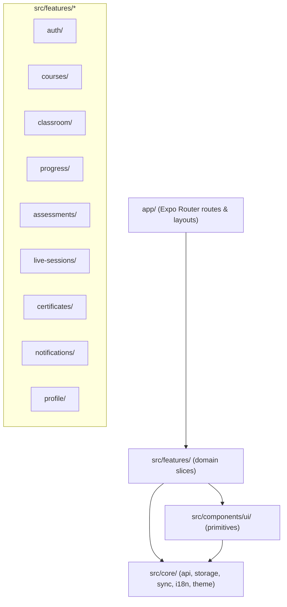
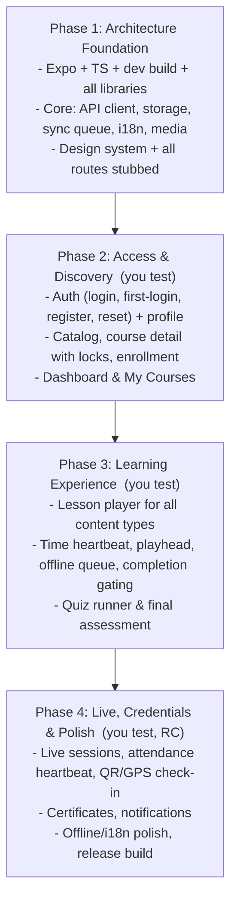

# Learner Mobile App — Architecture & Tech Stack Plan

Companion to [LEARNER_MOBILE_API_SPEC.md](LEARNER_MOBILE_API_SPEC.md). Every design decision below maps to a backend behavior documented there (section numbers in `§x.y`).

## 1. Executive Summary & Design Philosophy

The Learner Mobile App serves `LEARNER`-role users of the LMS. Goals: **modularity, offline resilience, and strict alignment with backend rules** (sequential unlocking, time-spent policy, assessment gating, attendance thresholds) so that nothing the app shows can be contradicted by the server.

### Core Architectural Principles
1. **Vertical Feature Slices**: code grouped by domain (`auth`, `courses`, `classroom`, `progress`, `assessments`, `live-sessions`, `certificates`, `notifications`, `profile`).
2. **Thin Screens**: files in `src/app/` (Expo Router) only parse params and compose feature components. No business logic in route files.
3. **Strict Dependency Hierarchy**: `src/app/` → `features/` → `core/` + `components/ui/`. Features import siblings **only** through their `index.ts` barrel.
4. **Server Is the Source of Truth**: lock state, completion, eligibility and scores always come from the API (`§3.2`, `§6.1`). The client never computes unlocks itself — it only renders them and pre-checks to avoid pointless requests.
5. **Offline Resilience**: time heartbeats and playhead positions are buffered locally and synced on reconnect; gated actions (complete, submit, check-in) require connectivity and show a clear pending/offline state.
6. **Bilingual by Default**: every domain entity has `…En` / `…Am` fields; UI resolves them through one helper based on the user's `locale`.

---

## 2. Tech Stack

| Layer | Technology | Purpose / Backend reason |
|---|---|---|
| Framework | **Expo SDK 57** + React Native 0.86, New Architecture | Runs in **Expo Go** for Phases 1–4 (every native module is bundled in Expo Go); a dev build is only needed for native LiveKit (optional, Phase 4+). |
| Language | **TypeScript (strict)** | Types in `features/*/types` mirror the API spec exactly (strict backend whitelist, `§1.6`). |
| Navigation | **Expo Router** (version bundled with the SDK) | File-based routing, tabs, modals, deep links from notifications. |
| Server state | **@tanstack/react-query v5** | Caching, pagination (`meta.hasNextPage`), invalidation after progress/quiz mutations. |
| Query persistence | **@tanstack/react-query-persist-client** + async storage persister over expo-sqlite | Last-known catalog / enrollments / progress readable offline. |
| Client state | **Zustand** | Auth session, quiz runner, player session, live-attendance session. |
| Secure storage | **expo-secure-store** | Access + refresh tokens (Keychain / Keystore). |
| Local storage | **expo-sqlite/kv-store** (synchronous `SQLiteStorage`) | Cached user, offline sync queue, playhead positions, query cache, preferences. Chosen over local kv-store because it ships in Expo Go. |
| HTTP | **Axios** | Envelope unwrapping, single-flight token refresh with rotation, normalized errors. |
| Styling | **NativeWind v4** | Tailwind tokens shared with the Next.js web app. |
| Icons | **lucide-react-native** | Same icon set as the web app. |
| i18n | **i18next + react-i18next + expo-localization** | English / Amharic UI strings; `Accept-Language` header for localized errors. |
| Video | **expo-video** | `VIDEO` lessons from `resourceUrl`, playhead events, PiP, fullscreen. |
| Audio | **expo-audio** | `AUDIO` lessons. |
| Rich content | **react-native-webview** | `contentEn/contentAm` HTML, `DOCUMENT`/`PRESENTATION` viewers, `INTERACTIVE`/`SCORM` packages. |
| Links & browser | **expo-linking**, **expo-web-browser** | `EXTERNAL_LINK` lessons, Zoom/Meet/Teams join URLs, LiveKit web room (MVP). |
| Files | **expo-file-system** + **expo-sharing** + **expo-intent-launcher** | Download attachments & certificate PDFs to the cache; Android opens them in the phone's viewer (ACTION_VIEW), iOS via the share sheet / Quick Look. |
| QR scanning | **expo-camera** (barcode scanner) | `QR` check-in (`§8.6`). |
| Location | **expo-location** | `GPS` check-in coordinates (`§8.6`). |
| Network | **@react-native-community/netinfo** | Drives React Query `onlineManager` + sync-queue flushing. |
| App state | React Native `AppState` | Pause heartbeats in background (time policy integrity). |
| Live video | **LiveKit web SDK in react-native-webview** (loaded from jsDelivr) | In-app LiveKit rooms in Expo Go via the `§8.4` token endpoint. A native `@livekit/react-native` room is a later option (needs a dev build). |

---

## 3. High-Level Blueprint



---

## 4. Directory & Module Structure

```text
mobile/
├── app.json · eas.json · babel.config.js · metro.config.js · tailwind.config.js
├── .env.local                               # EXPO_PUBLIC_API_URL (gitignored; see .env.example)
└── src/
├── app/                                     # Expo Router routes (template convention: src/app)
│   ├── _layout.tsx                          # Providers: QueryClient(+persist), i18n, Theme; Stack.Protected auth gate
│   ├── +not-found.tsx
│   ├── dev/ui-gallery.tsx                   # dev-only design-system showcase
│   ├── (auth)/
│   │   ├── _layout.tsx
│   │   ├── login.tsx                        # §2.1 (branches on passwordChangeRequired)
│   │   ├── register.tsx                     # §2.4
│   │   ├── pending-approval.tsx             # after register / "awaiting approval" 401
│   │   ├── forgot-password.tsx              # §2.5 step 1
│   │   ├── verify-reset-code.tsx            # §2.5 step 2
│   │   ├── reset-password.tsx               # §2.5 step 3
│   │   └── first-login.tsx                  # §2.6 (code → new + confirm password)
│   ├── (tabs)/
│   │   ├── _layout.tsx                      # Tabs + unread badge (§10.2)
│   │   ├── index.tsx                        # Dashboard: continue learning, upcoming sessions
│   │   ├── my-courses.tsx                   # §4.1 (client-side status filter)
│   │   ├── catalog.tsx                      # §3.1 (search, infinite scroll)
│   │   ├── live-sessions.tsx                # §8.1
│   │   └── profile.tsx                      # §2.7, language, links to certificates
│   ├── course/[courseId]/
│   │   ├── index.tsx                        # §3.2 + §6.1 syllabus with locks, enroll/drop
│   │   ├── enroll.tsx                       # modal: delivery mode + in-person session picker (§4.2, §8.2)
│   │   └── learn/[lessonId].tsx             # classroom player (§5.1, §6.2–6.4)
│   ├── quiz/[assessmentId]/index.tsx        # quiz runner modal (§7.2–7.5)
│   ├── quiz/[assessmentId]/result.tsx       # graded review
│   ├── session/[sessionId]/
│   │   ├── index.tsx                        # §8.3 details, join, attendance %
│   │   └── check-in.tsx                     # QR scanner / GPS check-in (§8.6)
│   ├── venue/[venueId].tsx                  # §8.9 (text only — no coordinates)
│   ├── certificates/
│   │   ├── index.tsx                        # §9.1
│   │   └── [certificateId].tsx              # §9.3 detail, download/share
│   ├── notifications.tsx                    # §10.1, mark read, deep-link via metadata
│   └── settings/
│       ├── edit-profile.tsx                 # §2.7 PATCH /users/me, avatar upload
│       └── change-password.tsx              # §2.7
│
│   ├── core/
│   │   ├── config.ts                        # API_URL from EXPO_PUBLIC_API_URL
│   │   ├── auth/tokens.ts                   # token store (SecureStore + in-memory mirror)
│   │   ├── api/
│   │   │   ├── client.ts                    # Axios: baseURL /api/v1, auth header, envelope unwrap, refresh
│   │   │   ├── errors.ts                    # ApiError { status, message, messageAm, reason, remainingSeconds, remainingMinutes }
│   │   │   ├── endpoints.ts                 # Path builders for every endpoint in the spec
│   │   │   ├── types.ts                     # ApiEnvelope<T>, Paginated<T>, PaginationMeta, shared enums
│   │   │   └── query-client.ts              # QueryClient, onlineManager ↔ NetInfo, persister
│   │   ├── storage/
│   │   │   ├── secure.ts                    # expo-secure-store: access + refresh tokens
│   │   │   └── kv-storage.ts                # expo-sqlite kv stores: session, sync-queue, playhead, query-cache, preferences
│   │   ├── sync/
│   │   │   ├── sync-queue.ts                # durable queue (heartbeats, playhead saves)
│   │   │   └── useSyncOnReconnect.ts        # flush on NetInfo reconnect / app foreground
│   │   ├── i18n/
│   │   │   ├── index.ts                     # i18next init, locale from user.locale
│   │   │   ├── localized.ts                 # pickLocalized(entity, 'title') → titleEn | titleAm
│   │   │   └── locales/{en,am}.json
│   │   ├── media/
│   │   │   └── resolveMediaUrl.ts           # rewrite localhost MinIO hosts in dev (§1.8)
│   │   ├── theme/{colors,typography,interop}.ts   # hex tokens, text variants, NativeWind cssInterop
│   │   ├── hooks/{useNetworkStatus,useAppState,useDebounce,useInterval}.ts
│   │   └── utils/{formatters,cn}.ts         # dates, durations, file sizes; class merging
│   │
│   ├── components/
│   │   ├── PlaceholderScreen.tsx            # Phase 1 stand-in for unbuilt routes
│   │   ├── dev/DevPanel.tsx                 # health check, stub session, language (dev only)
│   ├── components/ui/
│   │   ├── AppText.tsx  Screen.tsx  Button.tsx  Card.tsx  Input.tsx  OtpInput.tsx  Badge.tsx  Avatar.tsx
│   │   ├── ProgressBar.tsx  ProgressRing.tsx  Skeleton.tsx  EmptyState.tsx
│   │   ├── ModalSheet.tsx  ErrorState.tsx  OfflineBanner.tsx  LockBadge.tsx
│   │
│   └── features/
│       ├── auth/            # session store, login/first-login/reset flows, AuthGate
│       ├── courses/         # catalog, course detail, syllabus tree, enrollment
│       ├── classroom/       # content renderers per LessonContentType, attachments
│       ├── progress/        # heartbeat engine, playhead store, completion gating
│       ├── assessments/     # quiz runner store, answer encoding, result review
│       ├── live-sessions/   # upcoming list, join, attendance heartbeat, check-in
│       ├── certificates/    # list, claim, download/share
│       ├── notifications/   # list, unread badge, deep-link resolver
│       └── profile/         # profile edit, avatar, password, language
```

---

## 5. Anatomy of a Feature Module

```text
src/features/courses/
├── api/
│   ├── course-queries.ts        # useCatalogCourses(params) [infinite], useCourse(id)
│   └── course-mutations.ts      # useSelfEnroll(), useDropEnrollment()
├── components/
│   ├── CourseCard.tsx
│   ├── CourseSyllabus.tsx       # module → lesson → sub-lesson tree with LockBadge
│   ├── CourseHeader.tsx
│   └── EnrollSheet.tsx          # delivery-mode + in-person session picker
├── hooks/
│   └── useCourseFilters.ts      # debounced search; client-side category/level filter
├── types/
│   └── course.types.ts          # ApiCourse, ApiCourseDetail, ApiModule, ApiLesson (spec §3)
└── index.ts                     # public barrel
```

**Boundary rule**: `src/app/` and other features import only from `@/features/<name>`. Query keys are centralized per feature (e.g. `courseKeys.detail(id)`) and exported so other features can invalidate them (e.g. `progress` invalidates `courseKeys.detail` after completion).

---

## 6. Critical Systems Design

### 6.1 API Client (`src/core/api/client.ts`)
- `baseURL = EXPO_PUBLIC_API_URL` (must end in **`/api/v1`**, `§1.1`).
- **Request interceptor**: `Authorization: Bearer <access>`, `Accept-Language: <user.locale>`.
- **Response interceptor (success)**: return `response.data.data` (unwrap `{ data, timestamp }`, `§1.3`). Paginated calls therefore resolve to `{ data, meta }`.
- **Response interceptor (error)**: normalize to `ApiError` — join `message` if it's an array; copy `reason`, `remainingSeconds`, `remainingMinutes`, `messageAm` (`§1.5`).
- **Types match the whitelist**: request DTO types contain only allowed fields; never spread entity objects into request bodies (extra fields → 400, `§1.6`).

### 6.2 Authentication & Token Refresh
- **Storage**: access + refresh tokens in **SecureStore** (read synchronously at startup, mirrored in memory). User + permissions cached in expo-sqlite kv-store.
- **Login branching**: if the payload has `passwordChangeRequired`, navigate to `first-login` with `challengeToken` and the masked email (display only). Otherwise persist the session.
- **Roles**: `user.roles` is `[{ role: "LEARNER", ... }]` → store `roleNames = roles.map(r => r.role)`. If the account lacks `LEARNER`, show "This app is for learners" and log out.
- **Single-flight refresh on 401**:
  1. The first 401 starts `POST /auth/refresh`; concurrent 401s await the same promise.
  2. Persist **both** new tokens (refresh tokens rotate and the old one is revoked immediately, `§1.7`). Writing the new refresh token must complete before any other refresh can run — otherwise two refreshes race and the second one fails.
  3. Replay the original requests.
  4. Refresh 401 → clear SecureStore/local kv-store, reset the query cache, redirect to `/(auth)/login`.
  5. Auth endpoints (`/auth/*`) skip the refresh retry.
- **Proactive refresh**: access tokens live 15 min. On app foreground, refresh if the token expires in < 60 s (decode `exp`).
- **Login errors**: map "awaiting administrator approval" → `pending-approval` screen; show other 401 messages as-is.

### 6.3 Course Structure & Sequential Locking
- The syllabus is built from **`GET /courses/:id`** (structure, content, attachments, `unlocked`) merged with **`GET /progress/courses/:id`** (`completed`, `timeSpentSeconds`, `requiredSeconds`, `assessment.passed`, `lastPosition`) — keyed by `lesson.id === progress.lessonId`.
- **Never use `GET /courses/:id/modules`** for learner UI (no lock flags; leaks other users' attempts, `§3.3`).
- A locked lesson shows `LockBadge` and isn't navigable. If the server still returns 403 (`LOCKED` or the enrollment message), show the message and refetch both queries.
- Not enrolled → show the outline read-only (content is nulled by the server) with an **Enroll** CTA.
- After any completion or quiz pass, invalidate `courseKeys.detail(courseId)`, `progressKeys.course(courseId)` and `enrollmentKeys.mine()`.

### 6.4 Enrollment Flow (`EnrollSheet`)
- `course.deliveryMode === 'ONLINE_ONLY'` → `POST /enrollments/self { courseId }`.
- `'BOTH'` → let the user choose online (as above) or in-person.
- `'IN_PERSON_ONLY'` or in-person chosen → load `GET /live-sessions?courseId=` filtered to `sessionType === 'IN_PERSON'` and `status === 'SCHEDULED'`, then send `{ courseId, deliveryMode: 'IN_PERSON_ONLY', sessionId }`.
- "My Courses" filtering by status happens **client-side** (`§4.1`).

### 6.5 Classroom Player & Content Rendering
`ClassroomStage` switches on `lesson.contentType`:
| contentType | Renderer |
|---|---|
| `VIDEO` | `ClassroomVideoPlayer` (expo-video) on `resolveMediaUrl(resourceUrl)` |
| `AUDIO` | `ClassroomAudioPlayer` (expo-audio) |
| `DOCUMENT`, `PRESENTATION` | WebView (PDF / Office viewer) or download via `expo-file-system` + `expo-sharing` |
| `INTERACTIVE`, `SCORM` | WebView on `resourceUrl` |
| `EXTERNAL_LINK` | `expo-web-browser` |

`contentEn/contentAm` renders under the stage in a WebView-based `LessonBody`, and attachments are listed from `lesson.attachments`. Lessons with `subLessons` render as a parent page with a sub-lesson list. Each sub-lesson is its own `learn/[lessonId]` route, and progress calls always use the sub-lesson's own ID.

### 6.6 Time Heartbeat & Playhead Sync (`src/features/progress`)
**Time heartbeat** (`PATCH /progress/lessons/:id/time`, `§6.4`):
- `useLessonHeartbeat(lessonId)` counts **active seconds**: the screen is focused, the app is in the foreground, and (for video/audio) the media is playing.
- Every **30 s**, send `{ secondsDelta }` with the real elapsed active seconds (integer, **clamped 1–300**; skip if 0). On unmount or background, flush the remainder if ≥ 1.
- The response updates `timeSpentSeconds / requiredSeconds / satisfied` in the progress cache (`setQueryData`), which drives the countdown and enables the **Mark complete** button.
- Offline: deltas go to the local kv-store **sync queue**, coalesced per lesson into chunks of ≤ 300 s, and flushed in order on reconnect.

**Playhead** (`lastPosition`):
- Written to local kv-store every 5 s. Synced to the server every 30 s and on pause/exit via `PATCH …/complete` with **`completed: <current server completion state>`** and `lastPosition` (`§6.3` — sending `false` would un-complete the lesson).
- Resume position = max(local local kv-store, server `lastPosition` from `§6.1`/`§6.2`).

**Completion** (`PATCH …/complete { completed: true }`):
- Enabled only when `satisfied`, the lesson's assessment (if any) is passed, and the device is online. **Never queued offline.**
- Error handling by `reason`: `TIME_NOT_MET` → show "`remainingSeconds` s more"; `ASSESSMENT_NOT_PASSED` → open the quiz; `LOCKED` → refetch the syllabus.
- `VIDEO`: on `onEnded` with `satisfied`, auto-attempt completion.

### 6.7 Quiz Runner (`src/features/assessments`)
- **Zustand `useQuizRunnerStore`**: `attemptId`, `attemptNumber`, `questions` (shuffled order if `shuffleQuestions`, options never shuffled), `answers: Record<questionId, number | string>`, `deadline` (epoch ms), `isSubmitting`. Answers are mirrored to local kv-store per `attemptId` so an app kill mid-quiz can resume.
- **Pre-flight**: `GET /assessments/:id` + `GET /assessments/:id/attempts`. Show remaining attempts (`maxAttempts − submitted`); ignore the `attempts` array embedded in the assessment payload.
- **Start**: `POST /assessments/:id/start`. It resumes any in-progress attempt, so the timer uses `deadline = now + remainingSeconds*1000` and ignores `timeLimitMinutes`. Untimed quizzes have no `remainingSeconds`.
- **Timer**: computed from `deadline` (survives backgrounding). At ≤ 0, auto-submit once.
- **Answer encoding** (`§7.4`): MULTIPLE_CHOICE / TRUE_FALSE → option **index** (number); SHORT_ANSWER → trimmed **string** in `selectedOption`. Never send `textAnswer`.
- **Submit** requires connectivity. On a network failure, keep the state and retry; the attempt stays pending server-side and `start` will resume it.
- **Result screen**: `score`, `passed`, `correctCount/totalQuestions`, and a per-question `review` (`selectedOption` vs `correctAnswer` rendered through `options`). Then invalidate progress, course and certificate queries.
- **Start errors**: `RETAKE_COOLDOWN` → "Retake available in `remainingMinutes` min". "Maximum attempts reached", locked, or not eligible for the final → disabled state with the server message.

### 6.8 Live Sessions & Attendance (`src/features/live-sessions`)
- **List**: `GET /live-sessions/upcoming/me`, grouped by day, with a `LIVE` badge. Branch on `sessionType`.
- **Join (virtual)**:
  1. `POST /attendance/sessions/:id/join`
  2. `GET /live-sessions/:id/join-url` → open `joinUrl` (`Linking.openURL` for Zoom/Meet/Teams/custom; `expo-web-browser` for LiveKit in the MVP).
  3. Start `useAttendanceHeartbeat`: `POST …/heartbeat { activeSeconds }` every 30 s (clamped 1–120) **while the meeting is active**.
  4. On return or close → `POST …/leave`.

  Because external apps put ours in the background, the heartbeat is tied to the session "in-meeting" state, not the screen. On the final leave, send the accumulated elapsed time (≤ 120 s per call, multiple calls if needed). Show `percentage` vs `threshold` when `GET /attendance/sessions/:id/visibility` returns `canView`.
- **Check-in (in-person)**: `check-in.tsx` offers:
  - **QR**: expo-camera scans a payload that must equal the session ID. On a match, `POST /attendance/checkin/:sessionId?method=QR`.
  - **GPS**: expo-location → `?method=GPS` with body `{ latitude, longitude }`.

  There is no manual-code option (the backend has no code field, `§8.6`).
- **Venue**: text details only (`name`, `building`, `branch`, `facilities`).
- **History**: `GET /attendance/me` in the session tab's "Past" segment.

### 6.9 Certificates
- List from `GET /certificates/me` (plain array).
- On a course whose progress has `courseCompletion.certificateEligible` but no certificate yet → **Claim** → `POST /certificates/claim?courseId=`. A `null` result means "not eligible yet"; refetch progress.
- **Download**: always fetch `GET /certificates/:id/download` right before downloading (presigned URLs expire after 1 h). `null` → "Certificate PDF is being prepared". Save with `expo-file-system`, open with `expo-sharing`.
- Show `certificateNumber` and `verificationCode`.

### 6.10 Notifications
- Tab badge: `GET /notifications/me/unread-count`, refetched on app foreground and every 60 s while foregrounded.
- List: infinite query on `GET /notifications/me`; pass `unreadOnly=true` only for the "Unread" filter and omit it otherwise (`§10.1`).
- Tapping an item → `PATCH /notifications/:id/read`, then deep-link using `type` + `metadata` (`courseId` → course, `assessmentId` → quiz, `sessionId` → session, `CERTIFICATE_ISSUED` → certificates).
- Push notifications are **out of scope**: the backend has no device-token endpoint.

### 6.11 Localization
- `user.locale` (`en` | `am`) selects the UI language. Changing it in Profile → `PATCH /users/me { locale }`.
- `pickLocalized(entity, 'title' | 'description' | 'content' | 'body')` returns the `…Am` field when the locale is `am` and it's non-empty, else `…En`.
- Error toasts use `messageAm[0]` when the locale is `am`.

### 6.12 Offline Strategy Summary
| Action | Offline behavior |
|---|---|
| Browse cached catalog / enrollments / syllabus | Served from the persisted query cache (read-only banner) |
| Lesson time heartbeat | Queued in local kv-store, coalesced, flushed on reconnect |
| Playhead save | local kv-store immediately; server sync queued |
| Mark complete, quiz start/submit, enroll/drop, check-in, claim | **Blocked** with an offline message (server validates policy) |
| Downloaded attachments / certificates | Available from `expo-file-system` |

### 6.13 Media URLs in Development
`resolveMediaUrl(url)` rewrites `localhost` / `127.0.0.1` hosts to the host of `EXPO_PUBLIC_API_URL`, for unsigned media only. Presigned certificate URLs must not be rewritten; they require `MINIO_ENDPOINT=<LAN IP>` on the backend (`§1.8`).

---

## 7. Implementation Roadmap

The build is delivered in **4 phases**. Full scope, test data and manual test scripts are in [LEARNER_MOBILE_IMPLEMENTATION_PHASES.md](LEARNER_MOBILE_IMPLEMENTATION_PHASES.md).



---

## 8. Checklist Before Starting Code

1. [x] **API spec verified against backend source**: see `LEARNER_MOBILE_API_SPEC.md`.
2. [x] **Architecture aligned with the spec**: this document.
3. [ ] **Initialize the project**: `npx create-expo-app@latest mobile` (default template, then add the libraries from §2). Use a **development build** (`npx expo run:android` / `run:ios`), because local kv-store, expo-camera and LiveKit need native modules.
4. [x] **Mobile env**: `.env.local` — USB: `http://localhost:3001/api/v1` + `npm run usb` (adb reverse); Wi-Fi: `http://<LAN_IP>:3001/api/v1`.
5. [ ] **Backend dev env**: set `MINIO_ENDPOINT=<LAN_IP>` in `backend/.env` so media and presigned certificate URLs load on a phone. Make sure port 3001 (API, from `PORT` in `backend/.env`) and 9000 (MinIO) are reachable on the LAN.
6. [ ] **Test account**: seeded learner `learner@gmail.com` / `password` (see `backend/prisma/seed.ts`).

### Known backend limitations (no backend changes planned; the app works around them)
- `GET /enrollments/me` ignores `status` → filtered client-side.
- `GET /courses` has no `category`/`level` filter → filtered client-side.
- No manual-code check-in, and no server-side QR validation or QR generation → QR payload = session ID.
- `GET /assessments/:id` and `GET /courses/:id/modules` embed all users' attempts → ignored by the app. This should be fixed server-side for privacy.
- The submit response has no `explanation` / `submittedAt` / `timeSpentSeconds` → read them from `GET /assessments/:id/attempts`.
- Venues have no coordinates → no map.
- No push-notification device registration → in-app notifications only.
- `GET /courses` and `GET /courses/:id` include owners'/trainers' **password hashes** in `owners[].user` / `trainers[].user` → the app ignores those fields; backend should select safe fields (security ticket).
- `sortBy` accepts only a fixed allow-list (spec §1.4) → the app does not send `publishedAt` / `enrolledAt`.
