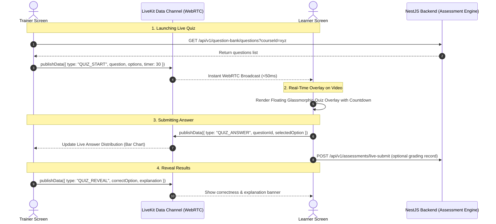

# Phase 2: LiveKit In-Room Interactive Learning (Quizzes, Polls & Hand-Raising)

> **Target Codebase**: MoR Tele E-Learning Training Management System (`eltms`)
> **Backend**: NestJS (TypeScript, Prisma, Assessments & QuestionBank Modules)
> **Frontend**: Next.js 14 (App Router, Tailwind CSS, LiveKit React Components)
> **Prerequisite**: Phase 1 completed (LiveKit WebRTC room and tokens working)
> **Goal**: Enable trainers to broadcast live quizzes and comprehension checks directly onto learners' video screens in real-time using LiveKit WebRTC Data Channels, collect responses with sub-50ms latency, and optionally record scores into the LMS assessment engine.

---

## 1. Overview & Architectural Pattern

Instead of adding and maintaining a separate Socket.IO / WebSocket server, Phase 2 leverages **LiveKit's built-in WebRTC Data Channels**:
- **Zero extra server infrastructure**: Uses the established WebRTC peer connection.
- **Ultra-low latency**: Messages arrive in < 50ms.
- **Reliable delivery**: LiveKit supports `{ reliable: true }` guarantee for interactive payloads.
- **Hybrid persistence**: Real-time interactions happen over LiveKit Data Channel; final submission/grading syncs asynchronously to the NestJS backend.



---

## 2. Real-Time Data Channel Protocol

Create a shared TypeScript contract for all LiveKit data packets (`frontend/src/types/livekit-events.ts` and optionally in `backend/src/common/interfaces/livekit-events.interface.ts`):

```typescript
export type LiveKitDataEvent =
  | {
      type: "QUIZ_START";
      payload: {
        id: string; // Quiz / Question ID
        titleEn: string;
        titleAm?: string;
        type: "SINGLE_CHOICE" | "MULTIPLE_CHOICE" | "TRUE_FALSE";
        options: Array<{ id: string; textEn: string; textAm?: string }>;
        timeLimitSeconds: number; // e.g. 30, 45, 60
        startedAt: number; // epoch ms
      };
    }
  | {
      type: "QUIZ_ANSWER";
      payload: {
        questionId: string;
        userId: string;
        userName: string;
        selectedOptionIds: string[];
        submittedAt: number;
      };
    }
  | {
      type: "QUIZ_REVEAL";
      payload: {
        questionId: string;
        correctOptionIds: string[];
        explanationEn?: string;
        explanationAm?: string;
        distribution: Record<string, number>; // e.g. { "A": 12, "B": 2 }
      };
    }
  | {
      type: "QUIZ_CLOSE";
      payload: {
        questionId: string;
      };
    }
  | {
      type: "HAND_RAISE";
      payload: {
        userId: string;
        userName: string;
        raised: boolean;
      };
    };
```

---

## 3. Backend Integration (NestJS)

### 3.1 Course Question Retrieval for Live Sessions
Ensure trainers can query questions from the Question Bank associated with the session's course.
- **Existing endpoint**: `GET /api/v1/question-bank/questions?courseId=...`
- Verify that this endpoint returns questions with bilingual text (`titleEn`, `titleAm`), `options`, and `correctAnswers`.

### 3.2 Live Quiz Grading & Submission Endpoint (`backend/src/modules/assessments/`)
If the trainer designates the in-session quiz as graded for course completion:
- **Route**: `POST /api/v1/live-sessions/:id/quiz-response`
- **Request Body**:
  ```typescript
  export class SubmitLiveQuizDto {
    @IsString()
    questionId: string;

    @IsArray()
    selectedOptionIds: string[];

    @IsNumber()
    responseDurationSeconds: number;
  }
  ```
- **Service Logic**:
  - Validates learner is enrolled in the session's course.
  - Scores the question using existing grading logic in `backend/src/modules/assessments/grading.util.ts`.
  - Persists record in `AssessmentAttempt` or creates an audit log entry in `attendance_logs` metadata.
  - Returns `{ isCorrect: boolean, score: number, explanation: string }`.

---

## 4. Frontend Custom Hook: LiveKit Data Channel

Create a reusable hook `frontend/src/hooks/useLiveKitDataChannel.ts`:
- Uses `useRoomContext()` from `@livekit/components-react`.
- Subscribes to `RoomEvent.DataReceived`:
  ```typescript
  import { useEffect } from "react";
  import { useRoomContext } from "@livekit/components-react";
  import { RoomEvent } from "livekit-client";
  import type { LiveKitDataEvent } from "@/types/livekit-events";

  export function useLiveKitDataChannel(onEvent: (event: LiveKitDataEvent) => void) {
    const room = useRoomContext();

    const broadcast = async (event: LiveKitDataEvent) => {
      if (!room || room.state !== "connected") return;
      const payload = new TextEncoder().encode(JSON.stringify(event));
      await room.localParticipant.publishData(payload, { reliable: true });
    };

    useEffect(() => {
      if (!room) return;
      const handleData = (payload: Uint8Array) => {
        try {
          const str = new TextDecoder().decode(payload);
          const data = JSON.parse(str) as LiveKitDataEvent;
          onEvent(data);
        } catch {
          // ignore non-json or foreign packets
        }
      };

      room.on(RoomEvent.DataReceived, handleData);
      return () => {
        room.off(RoomEvent.DataReceived, handleData);
      };
    }, [room, onEvent]);

    return { broadcast };
  }
  ```

---

## 5. UI Components

### 5.1 Trainer Control Component (`frontend/src/components/features/sessions/interactive/LiveQuizTrainerControl.tsx`)
A dedicated control panel accessible only to users with trainer/admin roles inside the session:
1. **Question Selector Drawer**:
   - Fetches questions from `/api/v1/question-bank/questions?courseId=${session.courseId}`.
   - Allows quick search/filter by tag or difficulty.
   - Configurable timer (15s, 30s, 60s, or untimed).
2. **"Launch to Room" Button**:
   - Dispatches `QUIZ_START` broadcast via Data Channel.
3. **Live Answer Monitor (Trainer View)**:
   - Aggregates incoming `QUIZ_ANSWER` events in real time.
   - Shows live animated progress bar for each option (e.g. Option A: 65%, Option B: 35%).
   - Counts number of responses received vs total participants in room.
4. **"Reveal Answers & End" Button**:
   - Dispatches `QUIZ_REVEAL` containing correct answers, explanation, and final percentage distribution.

### 5.2 Learner Interactive Overlay (`frontend/src/components/features/sessions/interactive/LiveQuizLearnerOverlay.tsx`)
A non-intrusive, floating interactive card rendered directly above the video stream:
1. **Positioning & Style**:
   - Glassmorphic Tailwind styling: `absolute bottom-20 left-1/2 -translate-x-1/2 w-full max-w-lg bg-slate-900/95 backdrop-blur-md border border-slate-700/80 rounded-2xl shadow-2xl p-5 z-40`.
2. **Components**:
   - **Countdown Bar**: Animated progress bar changing from indigo to amber to red as seconds run down.
   - **Bilingual Question Header**: Displays English and Amharic text side-by-side or toggled.
   - **Option Buttons**: Large clickable cards with radio/check icons.
   - **Submit Button**: Submits choice via `QUIZ_ANSWER` and locks selection.
   - **Reveal Screen**: Once time expires or trainer clicks reveal, displays:
     - Green border for correct answer, red for wrong.
     - Explanation text.
     - Answer breakdown chart showing how classmates voted.

### 5.3 Hand-Raising & Reaction Sync (`frontend/src/components/features/sessions/interactive/HandRaiseIndicator.tsx`)
- Learner clicks "Raise Hand" in the action bar -> sends `HAND_RAISE` event.
- Trainer screen displays an active list of raised hands with order of request.
- Trainer can click "Acknowledge" or "Lower Hand" for participants.

---

## 6. Integration with `LiveSessionWorkspace.tsx`

Update `frontend/src/components/features/sessions/LiveSessionWorkspace.tsx`:
1. Mount `useLiveKitDataChannel` inside the `<LiveKitRoom>` tree.
2. In the room bottom toolbar, add:
   - **For Trainers**: "Interactive Quiz / Question" button (with Sparkles / HelpCircle icon) opening `LiveQuizTrainerControl`.
   - **For Learners**: "Raise Hand" toggle button.
3. Overlay `<LiveQuizLearnerOverlay />` conditionally when `activeQuiz` state is non-null.

---

## 7. Verification & Testing Checklist

- [ ] **Data Channel Connectivity**:
  - Open Trainer in Browser A and Learner in Browser B (or Incognito).
  - Open WebRTC connection; ensure messages sent with `publishData` are received without console warnings.
- [ ] **Question Broadcast**:
  - Trainer selects a Question Bank question and clicks "Launch".
  - Learner screen immediately displays the quiz card within < 100ms.
- [ ] **Countdown & Auto-Lock**:
  - Countdown timer decrements smoothly from 30s to 0s.
  - Options become disabled when timer reaches 0.
- [ ] **Answer Tallying**:
  - Learner selects Option B and submits.
  - Trainer's live bar chart updates instantaneously to reflect 1 response on Option B.
- [ ] **Result Reveal**:
  - Trainer clicks "Reveal Answer".
  - Learner card displays green/red status, explanation, and percentage distribution.
- [ ] **Persistence**:
  - Check that completed live quizzes are logged in backend if grading mode is active.
- [ ] **Build Validation**:
  - `npm run build` in `frontend` compiles with 0 TypeScript/ESLint errors.

