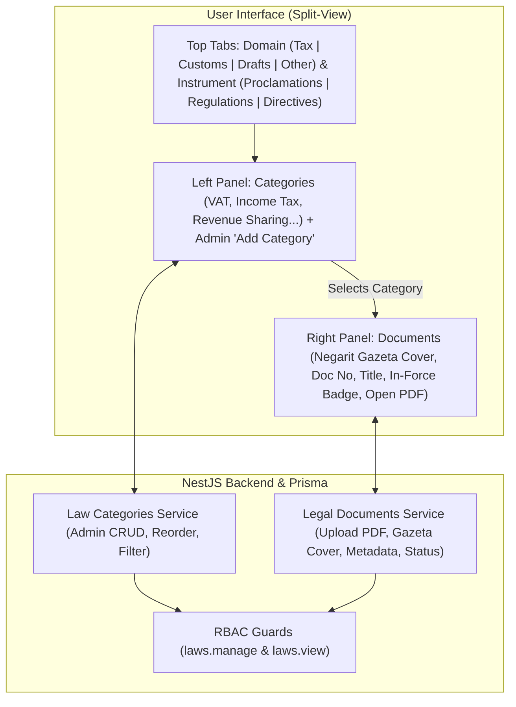

# Tax & Customs Laws Implementation Plan
## Two-Phase Plan for Legal Document & Knowledge Repository

**Goal**: Implement a dedicated, permission-controlled **Tax & Customs Laws** module in MOR2 with dynamic category management, Negarit Gazeta cover previews, PDF document attachments, and a clean **Master-Detail (Split-View)** interface that completely avoids deep-nesting clutter.

---

## Architecture Overview

Based on the design requirements and the reference UI, the system uses a **2-Level Navigation + Master-Detail Split View**:

1. **Top Selectors (Level 1 & 2)**:
   - **Domain**: Tax Laws (የታክስ ሕጎች) | Customs Laws (የጉምሩክ ሕጎች) | Draft Laws (ረቂቅ ሕጎች) | Other Documents (ሌሎች ሰነዶች)
   - **Instrument Type**: Proclamations (አዋጆች) | Regulations (ደንቦች) | Directives (መመሪያዎች) | Circulars (ሰርኩላሮች)
2. **Master-Detail Layout (Level 3 & 4 - Exactly matching the reference screen)**:
   - **Left Sidebar**: Dynamic **Categories** (e.g. *Sharing of Revenue Proclamation*, *Federal Tax Administration Proclamation*, *Turn Over Tax Proclamation*, *Value Added Tax Proclamation*, *Federal Income Tax Proclamation*, etc.) with `+ Add Category` for admins.
   - **Right Stage**: **Legal Document Cards** showing Negarit Gazeta cover thumbnail preview, Amharic & English titles, Proclamation Number (`33/1984`), `In Force` / `Repealed` status badges, and direct `OPEN / DOWNLOAD` PDF actions.



---

## Phase 1: Backend Architecture & API Services
*Focus: Database schema, RBAC permissions, NestJS module, file upload handling, and seeding*

### 1.1 Prisma Schema Extension (`backend/prisma/schema.prisma`)

Add the legal repository enums and models:

```prisma
enum LawDomain {
  TAX_LAW          // የታክስ ሕጎች
  CUSTOMS_LAW      // የጉምሩክ ሕጎች
  DRAFT_LAW        // ረቂቅ ሕጎች
  OTHER_DOCUMENTS  // ሌሎች ሰነዶች
}

enum LawInstrumentType {
  PROCLAMATION     // አዋጅ
  REGULATION       // ደንብ
  DIRECTIVE        // መመሪያ
  CIRCULAR         // ሰርኩላር
  OTHER            // ሌሎች
}

enum LawStatus {
  IN_FORCE         // በሥራ ላይ ያለ
  REPEALED         // የተሻረ
  AMENDED          // የተሻሻለ
  DRAFT            // ረቂቅ
}

// Dynamic Category managed by Admins (e.g. "Sharing of Revenue Proclamation", "Value Added Tax Proclamation")
model LawCategory {
  id              String            @id @default(uuid())
  domain          LawDomain         @map("domain")
  instrumentType  LawInstrumentType @map("instrument_type")
  nameEn          String            @map("name_en")
  nameAm          String?           @map("name_am")
  description     String?           @db.Text
  order           Int               @default(0)
  
  documents       LegalDocument[]
  
  createdAt       DateTime          @default(now()) @map("created_at")
  updatedAt       DateTime          @updatedAt @map("updated_at")

  @@index([domain, instrumentType])
  @@map("law_categories")
}

// Legal Document entity with Negarit Gazeta cover preview and PDF attachment
model LegalDocument {
  id              String         @id @default(uuid())
  categoryId      String         @map("category_id")
  category        LawCategory    @relation(fields: [categoryId], references: [id], onDelete: Cascade)
  
  documentNumber  String         @map("document_number") // e.g. "33/1984" or "979/2016"
  titleEn         String         @map("title_en")
  titleAm         String?        @map("title_am")
  descriptionEn   String?        @map("description_en") @db.Text
  descriptionAm   String?        @map("description_am") @db.Text
  status          LawStatus      @default(IN_FORCE) @map("status")
  yearIssued      Int?           @map("year_issued")     // e.g. 1984, 2016
  
  // File attachments
  coverImageUrl   String?        @map("cover_image_url") // Negarit Gazeta cover thumbnail preview
  pdfUrl          String         @map("pdf_url")         // The attached PDF file
  fileName        String         @map("file_name")
  fileSize        Int?           @map("file_size")
  
  createdById     String         @map("created_by_id")
  createdBy       User           @relation(fields: [createdById], references: [id])
  
  createdAt       DateTime       @default(now()) @map("created_at")
  updatedAt       DateTime       @updatedAt @map("updated_at")
  deletedAt       DateTime?      @map("deleted_at")

  @@index([categoryId, status])
  @@index([createdById])
  @@map("legal_documents")
}
```

### 1.2 Permissions & Role Matrix (`backend/prisma/seed-permissions.ts`)

Define explicit permissions for legal repository management:

| Permission Code | Resource | Action | Scope | Description |
|-----------------|----------|--------|-------|-------------|
| `laws.manage` | `laws` | `manage` | `ALL` | Full admin control: create, edit, delete categories and upload/remove legal documents |
| `laws.view` | `laws` | `view` | `ALL` | Read-only access for learners and trainees to browse, preview, and download laws |

**Role Assignment:**
- `SYSTEM_ADMIN`: `laws.manage`, `laws.view`
- `CONTENT_APPROVER`: `laws.manage`, `laws.view`
- `TRAINING_ADMIN`: `laws.manage`, `laws.view`
- `LEARNER`: `laws.view`
- `TRAINER`: `laws.view`

### 1.3 Legal Documents NestJS Module (`backend/src/modules/legal-documents/`)

Create module structure:
```
backend/src/modules/legal-documents/
├── legal-documents.module.ts
├── controllers/
│   ├── law-categories.controller.ts
│   └── legal-documents.controller.ts
├── services/
│   ├── law-categories.service.ts
│   └── legal-documents.service.ts
└── dto/
    ├── create-law-category.dto.ts
    ├── update-law-category.dto.ts
    ├── create-legal-document.dto.ts
    ├── update-legal-document.dto.ts
    └── query-legal-document.dto.ts
```

#### API Endpoints Contract:

| Method | Endpoint | Guard / Permission | Description |
|--------|----------|-------------------|-------------|
| `GET` | `/laws/categories` | `laws.view` or Authenticated | List categories filtered by `domain` & `instrumentType` |
| `POST` | `/laws/categories` | `laws.manage` | Create a new dynamic category |
| `PATCH` | `/laws/categories/:id` | `laws.manage` | Update category name (English/Amharic) or reorder |
| `DELETE` | `/laws/categories/:id` | `laws.manage` | Delete category (with document count protection) |
| `GET` | `/laws/documents` | `laws.view` or Authenticated | Search & list documents by category, status, keyword |
| `GET` | `/laws/documents/:id` | `laws.view` or Authenticated | Get document details |
| `POST` | `/laws/documents` | `laws.manage` | Create document with PDF URL, Gazeta cover image, metadata |
| `PATCH` | `/laws/documents/:id` | `laws.manage` | Update document metadata, status (`IN_FORCE`, `REPEALED`), or files |
| `DELETE` | `/laws/documents/:id` | `laws.manage` | Soft-delete a legal document |

### 1.4 Seeding Default Legal Tax & Customs Categories (`backend/prisma/seed-laws.ts`)

Seed the initial set of categories shown in the screenshot so the system works immediately out of the box:
- **Tax Law Proclamations**:
  - `Sharing of Revenue Proclamation` (with sample Proclamation No. 33/1984)
  - `Federal Tax Administration Proclamation`
  - `Turn Over Tax Proclamation`
  - `Higher Education Cost Sharing Proclamation`
  - `Federal Income Tax Proclamation`
  - `Value Added Tax Proclamation`
  - `Stamp Duty Proclamation`
  - `Excise Tax Proclamation`
- **Tax Law Regulations & Directives**: Seed basic starter categories.
- **Customs Laws**: Seed starter categories (*Customs Tariff Regulation*, *Customs Valuation Directive*, etc.).

---

## Phase 2: Frontend Web Implementation
*Focus: Sidebar integration, Admin management interface, and Learner split-view portal*

### 2.1 Navigation & Dynamic Sidebar Integration (`frontend/src/constants/navigation.ts`)

Add the capability navigation entry:

```typescript
// Inside DYNAMIC_CAPABILITY_NAV_ITEMS:
{
  label: 'Tax & Customs Laws',
  href: '/manage/laws',
  icon: Scale, // or Gavel / FileText from lucide-react
  permission: 'laws.manage',
}

// Inside learner navigation:
{
  label: 'Tax & Customs Laws',
  href: '/learner/laws',
  icon: Scale,
  permission: 'laws.view',
}
```

### 2.2 API Client & TanStack Query Hooks (`frontend/src/lib/api/`)

1. **Endpoints** (`endpoints.ts`):
   ```typescript
   laws: {
     categories: (params?: string) => `laws/categories${params ? `?${params}` : ''}`,
     categoryDetail: (id: string) => `laws/categories/${id}`,
     documents: (params?: string) => `laws/documents${params ? `?${params}` : ''}`,
     documentDetail: (id: string) => `laws/documents/${id}`,
   }
   ```
2. **Hooks** (`frontend/src/features/laws/api/law-queries.ts`):
   - `useLawCategories(domain, instrumentType)`
   - `useLegalDocuments(categoryId, status, search)`
   - `useCreateLawCategory()`, `useUpdateLawCategory()`, `useDeleteLawCategory()`
   - `useCreateLegalDocument()`, `useUpdateLegalDocument()`, `useDeleteLegalDocument()`

### 2.3 Admin Management UI (`frontend/src/app/(dashboard)/manage/laws/page.tsx`)

A dedicated management dashboard for actors with `laws.manage`:
1. **Header & Domain Tabs**:
   - `[ 🏛️ Tax Laws ]` | `[ 🚢 Customs Laws ]` | `[ 📄 Draft Laws ]` | `[ 📁 Other Documents ]`
2. **Instrument Pills**:
   - `[ Proclamations (አዋጆች) ]` | `[ Regulations (ደንቦች) ]` | `[ Directives (መመሪያዎች) ]` | `[ Circulars (ሰርኩላሮች) ]`
3. **Left Column (Categories Manager)**:
   - Header with `+ Add Category` button.
   - List of categories with badge counts of documents.
   - Edit (pencil) and Delete (trash) actions on hover for each category.
   - Modal for creating/editing a category (English name, Amharic name).
4. **Right Column (Document Management)**:
   - Action header with search bar and `+ Upload Document` button.
   - Card/Table view matching the Negarit Gazeta card design:
     - Negarit Gazeta cover image preview.
     - Document Number (e.g. `33/1984`).
     - Amharic & English title.
     - Status switcher (`In Force` vs `Repealed` vs `Draft`).
     - Action buttons: Edit, Replace PDF, Delete, Preview.
   - Modal for uploading/editing a document:
     - Document Number input.
     - English & Amharic Title inputs.
     - Negarit Gazeta Cover Thumbnail file dropzone.
     - PDF File dropzone.
     - Status selector (`In Force`, `Repealed`, `Amended`, `Draft`).

### 2.4 Learner Knowledge Portal (`frontend/src/app/(dashboard)/learner/laws/page.tsx`)

The learner-facing legal knowledge page matching the screenshot:
1. **Search & Filter Header**:
   - Prominent search input (*"Search proclamation by title, number like 33/1984, or keyword..."*).
   - Domain selector and Instrument pill tabs.
2. **Left Master Panel (Categories)**:
   - Clean vertical list of categories with active highlight:
     - Active item highlighted in amber/brand color (e.g. `Sharing of Revenue Proclamation`).
     - Smooth click transition to load documents on the right.
3. **Right Detail Panel (Document Showcase)**:
   - Renders the Negarit Gazeta document cards as shown in the screenshot:
     - White card with subtle border and shadow.
     - Left thumbnail: Negarit Gazeta header image (`NEGARIT GAZETA`).
     - Right details: Amharic title in bold Ethiopic typography (`የማዕከላዊ የሽግግር መንግሥት እና የብሔራዊ ክልላዊ መስተዳደሮችን ገቢ ለመወሰን የወጣ አዋጅ`).
     - `Proclamation Number: 33/1984`.
     - Status badge: `In Force` (green pill) or `Repealed` (amber/gray pill).
     - Blue `OPEN` button with download/eye icon:
       - Tapping opens in-app PDF preview modal with download button.
4. **Responsive Mobile Behavior**:
   - On desktop: Full split-view side-by-side.
   - On mobile/tablet: Left category list collapses into a clean drawer or top horizontal pill carousel.

---

## Execution Checklist

### Phase 1: Backend
- [x] Update `backend/prisma/schema.prisma` with `LawDomain`, `LawInstrumentType`, `LawStatus`, `LawCategory`, and `LegalDocument`.
- [x] Run `npx prisma db push` and `npx prisma generate`.
- [x] Register `laws.manage` and `laws.view` in `backend/prisma/seed-permissions.ts`.
- [x] Create `LegalDocumentsModule`, controllers, services, and DTOs in `backend/src/modules/legal-documents/`.
- [x] Wire file upload support for Gazeta cover images and PDFs.
- [x] Create seed script with the initial tax proclamation categories.
- [x] Verify endpoints with automated tests (`8 passed`).

### Phase 2: Frontend
- [x] Add `Tax & Customs Laws` item with permission check to `DYNAMIC_CAPABILITY_NAV_ITEMS` and `PERMISSION_GATED_PATHS` in `navigation.ts`.
- [x] Create TypeScript types and API client functions in `frontend/src/types/laws.ts` and `frontend/src/lib/api/laws.ts`.
- [x] Build Admin Management page (`/laws-management`) with `+ Add Category` and `+ Upload Document` modals.
- [x] Build Learner Knowledge Library page (`/laws`) with split-view layout, Gazeta cards, and PDF viewer modal.
- [x] Verify full end-to-end flow and production builds on both backend and frontend (`next build` & `nest build` 100% passed).

