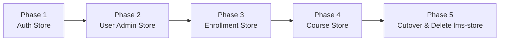

# Incremental Zustand Migration Plan: Retiring `lms-store.tsx`

## 1. Executive Summary & Goals

### The Problem
`frontend/src/lib/lms-store.tsx` is an **1,809-line monolithic "God Object"** implemented using React's built-in Context API (`createContext` + `useContext`). 
- **118 components** across the application consume `useLms()`.
- **Re-render cascades**: Because all state (auth, courses, enrollments, users, language) lives inside a single Context value, any state change (e.g., reloading courses or updating an enrollment) forces **all 118 components** to re-render.
- **Hook-only limitation**: Context values cannot be accessed outside of React component trees, complicating token refreshes, interceptors, and non-React utilities in `client.ts`.

### The Goal
Incrementally migrate `lms-store.tsx` into **4 focused, modular Zustand stores** across **5 risk-free phases**.
- **Zero Breaking Changes**: We employ the **Facade Proxy Pattern**. Each new Zustand store is bridged back into `lms-store.tsx` so existing components continue to function normally during migration.
- **Fine-Grained Selectors**: Components only re-render when the specific slice of state they subscribe to changes.
- **Complete Retirement**: Once all components are updated, `lms-store.tsx` and the `<LmsProvider>` wrapper in `AppProviders.tsx` will be completely deleted.

---

## 2. Target Architecture Overview

Instead of one giant store, state is segregated by domain:

```
frontend/src/lib/stores/
├── auth-store.ts        # Phase 1: Auth tokens, currentUser, login/logout, profile, permissions, locale
├── user-store.ts        # Phase 2: User directory, roles, suspensions, bulk registration, actor creation
├── enrollment-store.ts  # Phase 3: Learner enrollments, self-enrollment, bulk admin enrollment
├── course-store.ts      # Phase 4: Course catalog, authoring, covers, approvals, trainer assignments
└── prepared-quiz-store.ts # (Already exists in Zustand)
```

### The Facade Proxy Pattern (How We Guarantee Zero Breakages)
During Phases 1–4, `lms-store.tsx` is NOT deleted. Instead, it delegates its methods to the new Zustand stores:

```typescript
// Inside LmsProvider (lms-store.tsx during transition):
export function LmsProvider({ children }: { children: ReactNode }) {
  // Proxied from Zustand stores
  const currentUser = useAuthStore((s) => s.currentUser);
  const login = useAuthStore((s) => s.login);
  const users = useUserStore((s) => s.users);
  const courses = useCourseStore((s) => s.courses);

  // Expose them in the existing LmsContextValue
  const value = useMemo(() => ({
    currentUser,
    login,
    users,
    courses,
    ...
  }), [...]);

  return <LmsContext.Provider value={value}>{children}</LmsContext.Provider>;
}
```

Components can be migrated to `useAuthStore` or `useCourseStore` one at a time. Nothing breaks if a component still calls `useLms()`.

---

## 3. The 5 Migration Phases



---

### Phase 1: Authentication, Profile & Session Store (`auth-store.ts`)

#### Objective
Extract all authentication, user session, profile management, permission refreshes, and language/locale settings into `useAuthStore`.

#### State & Actions to Extract
- **State**: `ready: boolean`, `currentUser: User | null`, `lang: Lang`
- **Actions**:
  - `initAuth()`
  - `login(email, password)`
  - `logout()`
  - `register(input)`
  - `verifyEmail(email, code)`
  - `completeFirstLogin(input)`
  - `updateProfile(input)`
  - `changePassword(input)`
  - `refreshPermissions()`
  - `setLang(lang)` / `updateLocale(lang)`

#### Implementation Steps
1. Create `frontend/src/lib/stores/auth-store.ts` using `create` from `zustand`.
2. Connect `initAuth()` to load stored tokens and fetch the profile on startup via `fetchMyProfile()`.
3. Wire up 401 unauthorized handling directly: `setUnauthorizedHandler(() => useAuthStore.getState().logout())`.
4. In `lms-store.tsx`: Remove local `currentUser`, `lang`, and `ready` useState hooks. Read them from `useAuthStore` and pass them into `LmsContext.Provider`.
5. Update core auth consumers:
   - `src/components/layout/Navbar.tsx` (or Header/Sidebar components reading `currentUser`).
   - `src/app/(auth)/login/page.tsx` & `src/app/(auth)/register/page.tsx`.
6. Run `npx tsc --noEmit` to verify type safety.

---

### Phase 2: User Administration Store (`user-store.ts`)

#### Objective
Extract the user directory, trainer lookups, role assignments, suspensions, and bulk account creations into `useUserStore`.

#### State & Actions to Extract
- **State**:
  - `users: User[]`
  - `userNames: Record<string, string>` (cached id-to-fullname resolver)
  - `loadingUsers: boolean`
- **Actions**:
  - `fetchUsersList()`
  - `userName(userId)`
  - `changeUserRole(userId, role)`
  - `deactivateUser(userId)`
  - `reactivateUser(userId)`
  - `deleteUser(userId)`
  - `bulkUserAction(action, userIds)`
  - `bulkRegisterUsers(rows)`
  - `registerActor(input)`
  - `registerUser(input)`

#### Implementation Steps
1. Create `frontend/src/lib/stores/user-store.ts`.
2. Move user management API calls (`@/lib/api/users`) into store actions.
3. In `lms-store.tsx`: Delegate `users`, `userNames`, `userName`, `changeUserRole`, `bulkUserAction`, etc. to `useUserStore`.
4. Migrate admin components:
   - `src/app/(dashboard)/admin/users/` (User table and modals).
   - `src/components/features/users/` components.
5. Run `npx tsc --noEmit` to verify.

---

### Phase 3: Enrollment Management Store (`enrollment-store.ts`)

#### Objective
Extract all enrollment state and actions (learner self-enrollment and admin bulk enrollment) into `useEnrollmentStore`.

#### State & Actions to Extract
- **State**:
  - `myEnrollments: ApiEnrollment[]`
  - `loadingEnrollments: boolean`
- **Actions**:
  - `fetchMyEnrollmentsList()`
  - `getEnrollmentForCourse(courseId)`
  - `enrollSelf(courseId, options)`
  - `enrollLearners(courseId, learnerIds)`

#### Implementation Steps
1. Create `frontend/src/lib/stores/enrollment-store.ts`.
2. Move enrollment API interactions (`@/lib/api/enrollments`) into store actions.
3. In `lms-store.tsx`: Remove `myEnrollments` state and proxy it from `useEnrollmentStore`.
4. Migrate learner dashboard and catalog enrollment buttons:
   - `src/app/(dashboard)/learner/page.tsx`.
   - `src/components/features/courses/CatalogCourseModal.tsx` enrollment CTA.
   - `src/components/features/courses/detail/CourseEnrollmentCard.tsx`.
5. Run `npx tsc --noEmit` to verify.

---

### Phase 4: Course Authoring & Management Store (`course-store.ts`)

#### Objective
Extract course catalogs, authoring pipelines (`createCourse`, `updateCourseFull`), curriculum synchronization, approval workflows, covers, and trainer assignments into `useCourseStore`.

#### State & Actions to Extract
- **State**:
  - `courses: Course[]`
  - `loadingCourses: boolean`
- **Actions**:
  - `fetchCoursesList()`
  - `courseById(courseId)`
  - `refreshCourse(courseId)`
  - `createCourse(input)`
  - `updateCourse(courseId, input)`
  - `updateCourseFull(courseId, input)`
  - `saveCourseCover(courseId, file)`
  - `assignTrainerToCourse(courseId, trainerId)`
  - `unassignTrainerFromCourse(courseId, trainerId)`
  - `submitForApproval(courseId)`
  - `approveCourse(courseId)`
  - `rejectCourse(courseId, reason)`
  - `requestChangesCourse(courseId, reason)`
  - `returnCourseToDraft(courseId, reason)`
  - `publishCourse(courseId)`
  - `unpublishCourse(courseId)`
  - `archiveCourse(courseId)`
  - `deleteCourse(courseId)`

#### Implementation Steps
1. Create `frontend/src/lib/stores/course-store.ts`.
2. Move curriculum and assessment sync helper functions (`syncCurriculumAndAssessments`, `formatQuestionsForApi`, etc.) into `course-store.ts` or a dedicated `course-sync.ts` utility.
3. In `lms-store.tsx`: Proxy all remaining course actions from `useCourseStore`.
4. Migrate Course Creator and Review stages:
   - `src/components/features/courses/creator/CourseCreatorShell.tsx`.
   - `src/components/features/courses/review/CourseReviewShell.tsx`.
   - `src/components/features/courses/detail/CourseDetailPage.tsx`.
5. Run `npx tsc --noEmit` to verify.

---

### Phase 5: Component Cutover & Final Deletion of `lms-store.tsx`

#### Objective
Sweep all remaining `useLms()` imports across the codebase, remove the `<LmsProvider>` root wrapper, and permanently delete `lms-store.tsx`.

#### Implementation Steps
1. **Search and Replace Imports**:
   - Run a global search for `import { useLms } from '@/lib/lms-store'` across all files.
   - Replace with the corresponding stores:
     - Auth: `import { useAuthStore } from '@/lib/stores/auth-store'`
     - Courses: `import { useCourseStore } from '@/lib/stores/course-store'`
     - Enrollments: `import { useEnrollmentStore } from '@/lib/stores/enrollment-store'`
     - Users: `import { useUserStore } from '@/lib/stores/user-store'`
2. **Remove Provider Wrapper**:
   - In `frontend/src/components/providers/AppProviders.tsx`:
     ```tsx
     // Before:
     <ThemeProvider>
       <LmsProvider>
         {children}
         <ToastContainer />
       </LmsProvider>
     </ThemeProvider>

     // After:
     <ThemeProvider>
       {children}
       <ToastContainer />
     </ThemeProvider>
     ```
3. **Delete Obsolete File**:
   - Delete `frontend/src/lib/lms-store.tsx`.
4. **Full Verification**:
   - Run `npx tsc --noEmit` in `frontend/`.
   - Run `npm run build` in `frontend/`.
   - Verify zero compile errors and verify auth login, course browsing, and course creation flows.

---

## 4. Phase Verification Checklist

| Phase | Target Store | Proxy Wired in `lms-store` | TypeScript Pass | Status |
| :--- | :--- | :---: | :---: | :--- |
| **Phase 1** | `auth-store.ts` | [ ] | [ ] | Pending |
| **Phase 2** | `user-store.ts` | [ ] | [ ] | Pending |
| **Phase 3** | `enrollment-store.ts` | [ ] | [ ] | Pending |
| **Phase 4** | `course-store.ts` | [ ] | [ ] | Pending |
| **Phase 5** | Cutover & Delete `lms-store.tsx` | N/A (Deleted) | [ ] | Pending |

---

## 5. Summary of Key Differences After Migration

| Metric / Feature | Old (`lms-store.tsx`) | New (Zustand Stores) |
| :--- | :--- | :--- |
| **File Structure** | 1 file (1,809 lines) | 4 modular files (~150–300 lines each) |
| **State Paradigm** | Monolithic React Context | Atomic Domain Stores |
| **Re-render Scope** | All 118 consumers re-render on any change | Only components subscribing to the changed slice re-render |
| **Out-of-React Access** | ❌ Impossible (needs React hook context) | ✅ Supported anytime via `.getState()` |
| **Root Provider Wrapper** | Required (`<LmsProvider>`) | None needed |
| **SSR / RSC Boundary** | Heavy client-side wrapper around whole app | Lightweight, zero-wrapper client stores |

